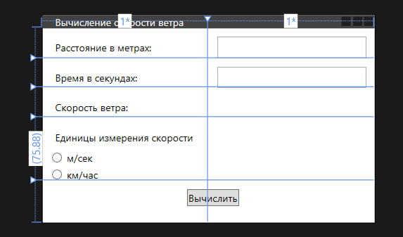
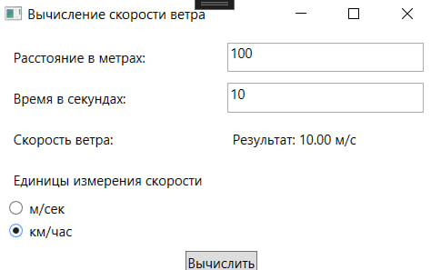

# Практическая работа №3
## Часть 2: Отладка программы различными способами

### Цель практической работы
Произвести процедуру отладки программного обеспечения встроенными средствами среды программирования Microsoft Visual Studio.

### Описание задания
Разработать приложение WPF, выполняющее вычисление скорости ветра в «метрах в секунду» или в «километрах в час». Пользователь может ввести только натуральные числа.

### Макет интерфейса

### Скриншот запущенного приложения

### Способы отладки Microsoft Visual Studio
- Точки останова
- Просмотр стека вызовов
- Точки трассировки

### Таблица 1. Журнал тестирования

| № | Выбранный переключатель | Входные данные | Вводимое значение | Ожидаемая реакция программы | Фактическая реакция программы | Ошибка выявлена | Вид ошибки |
|---|-------------------------|----------------|-------------------|-----------------------------|------------------------------|-----------------|------------|
| 1 | Выбран переключатель «м/сек» | Расстояние: 100, Время: 10 | 100, 10 | Результат: 10 м/с | Результат: 10 м/с | Нет | Корректно |
| 2 | Выбран переключатель «км/час» | Расстояние: 100, Время: 10 | 100, 10 | Результат: 36 км/ч | Результат: 36 км/ч | Нет | Корректно |
| 3 | Ни один переключатель не выбран | Расстояние: 100, Время: 10 | 100, 10 | Сообщение «Необходимо выбрать единицу измерения» | Сообщение «Необходимо выбрать единицу измерения» | Да | Некорректный выбор |
| 4 | Выбран переключатель «м/сек» | Расстояние: абв, Время: 10 | абв, 10 | Сообщение «Неверное значение. Повторите ввод» | Сообщение «Неверное значение. Повторите ввод» | Да | Некорректный ввод |
| 5 | Выбран переключатель «км/час» | Расстояние: 100, Время: | 100, | Сообщение «Необходимо ввести расстояние и время» | Сообщение «Необходимо ввести расстояние и время» | Да | Некорректный ввод |

### Таблица 2. Результаты отладки

| № теста, выявивший дефект | Метод отладки | Способ отладки Microsoft Visual Studio | Фактическая реакция программы | Ошибка исправлена |
|--------------------------|---------------|----------------------------------------|------------------------------|------------------|
| 3                        | Ручное тестирование | Точки останова | Сообщение «Необходимо выбрать единицу измерения» | Да |
| 4                        | Ручное тестирование | Точки останова | Сообщение «Неверное значение. Повторите ввод» | Да |
| 5                        | Ручное тестирование | Точки останова | Сообщение «Необходимо ввести расстояние и время» | Да |
